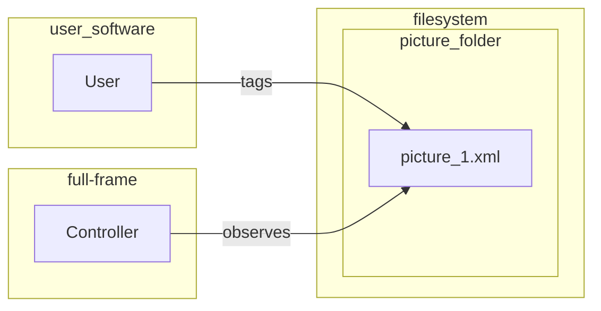
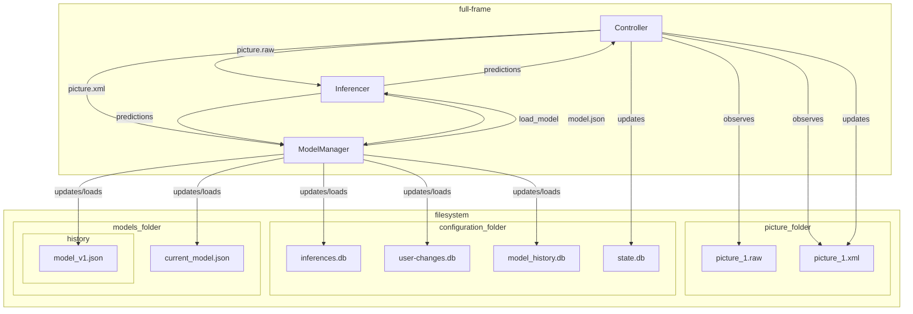

## Architecture Goals
- Keep each piece of the service well isolated.
  - No filesystem files should be shared between services

## Problems To Solve
- [ ] How do we identify tags generated by the AI, and tags generated by the user?
- [ ] How do we store inferences and user-changes? 
  - [ ] What should the format be?

## User Flow

## Software Communication

## Data Stores
### [Inferences Store](Data_Stores%2FInferences.md)

## Class Responsibility
### [Controller](classes%2FController.md)
### [Inferencer](classes%2FInferencer.md)
### [ModelManager](classes%2FModelManager.md)

