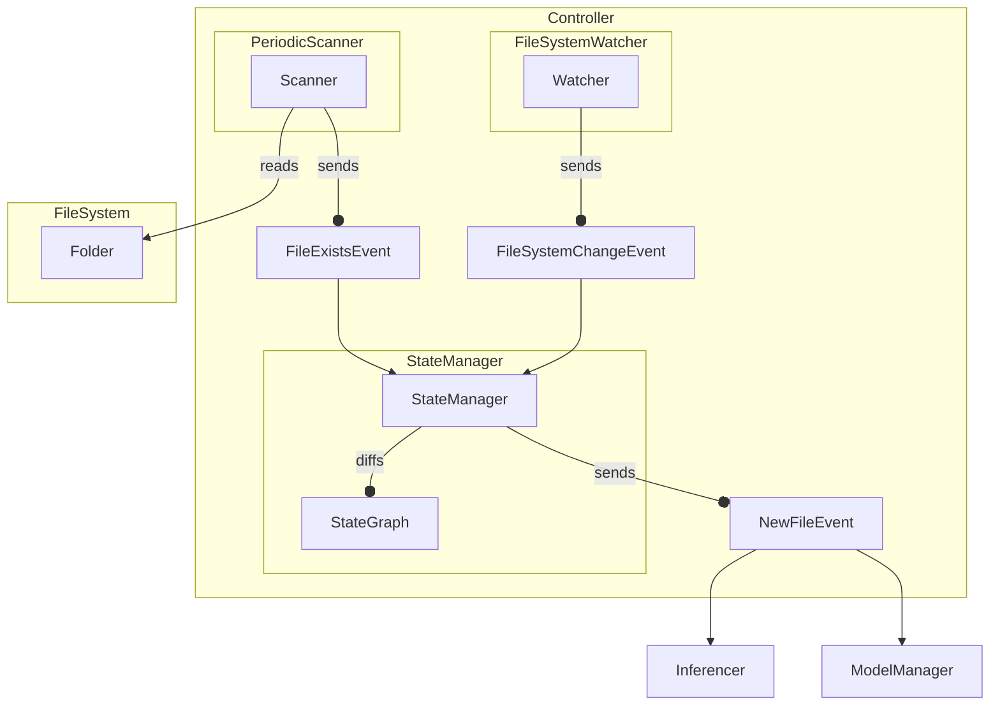

```mermaid
graph TB
    
    StateManager -- diffs --o StateGraph
    StateManager -- sends --o NewFileEvent
    NewFileEvent --> Inferencer
    NewFileEvent --> ModelManager
    
    Scanner -- reads --> Folder
    Scanner -- sends --o FileExistsEvent --> StateManager
    
    Watcher -- sends --o FileSystemChangeEvent --> StateManager
    
    Inferencer
    ModelManager
    
    subgraph Controller
        NewFileEvent
        FileSystemChangeEvent
        FileExistsEvent
        
        subgraph StateManager 
            StateManager 
            StateGraph
        end
        
        subgraph PeriodicScanner 
            Scanner
        end
        
        subgraph FileSystemWatcher 
            Watcher
        end
    end
    
    subgraph FileSystem 
        Folder
    end

```